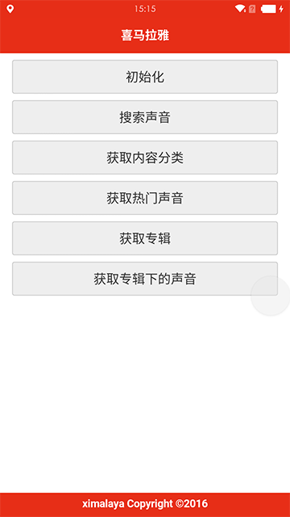

# 喜马拉雅 For APICloud的接入教程

* [测试接口](#testver)

* [打正式包](#finalver)

#**准备工作**

想使用测试包，请不要在APICloud创建证书，请不要在APICloud创建证书，请不要在APICloud创建证书

1、下载自定义模块，[传送门](https://github.com/bringmehome/ximalaya/blob/master/%E8%87%AA%E5%AE%9A%E4%B9%89%E6%A8%A1%E5%9D%97/ximalayakey.zip)

2、将此作为自定义模块上传到APICloud的对应项目，并使用

3、下载测试demo，[传送门](https://github.com/bringmehome/ximalaya/blob/master/%E6%B5%8B%E8%AF%95Demo/widget.zip)

4、解压后将其中的文件复制到自己的测试项目中，运行看看效果，是不是这个样子

#**打正式包**

因为调用喜马拉雅接口，需要先初始化，初始化的时候喜马拉雅会做身份校验

>1、创建应用获取appkey, appsecret, Android客户端包名, [创建应用](http://open.ximalaya.com/apps)

>2、