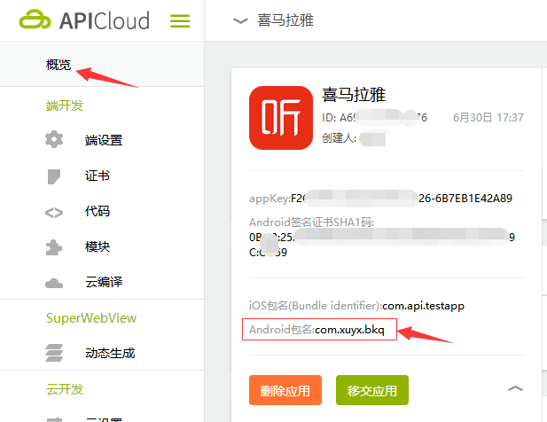
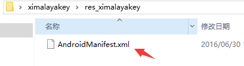
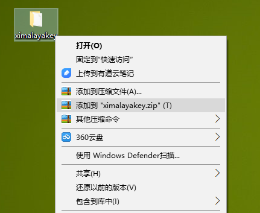

# 喜马拉雅 For APICloud的接入教程

* [创建自定义模块](#testver)

* [测试模块](#finalver)

#**创建自定义模块**

1、下载自定义模块，[传送门](https://github.com/bringmehome/ximalaya/blob/master/%E8%87%AA%E5%AE%9A%E4%B9%89%E6%A8%A1%E5%9D%97/ximalayakey.zip)

2、因为调用喜马拉雅接口，需要先初始化，而初始化的时候喜马拉雅会做身份校验, 这时候需要配置appkey，Android客户端包名，和传入appsecret, 于是需要完成以下几步

>1、创建应用获取appkey, appsecret, Android客户端包名, [创建应用](http://open.ximalaya.com/apps)

其中Android客户端包名获取，见下图，android的签名见包名上面

>2、解压刚刚下载的自定义模块ximalayakey.zip

>3、编辑AndroidManifest.xml文件，根据喜马拉雅开放平台我的应用的信息来修改其中的app_key和pack_id的value

>4、压缩文件夹为zip格式

#**测试模块**

1、将此作为自定义模块上传到APICloud的对应项目的自定义模块中，并使用，同时引用聚合API里的ximalaya模块

2、下载测试demo，[传送门](https://github.com/bringmehome/ximalaya/blob/master/%E6%B5%8B%E8%AF%95Demo/widget.zip)

3、解压测试demo，将其中的文件复制到自己的测试项目中，运行看看效果，是不是这个样子

如果还有其他问题请邮件(bringmehome@vip.qq.com)
(完)